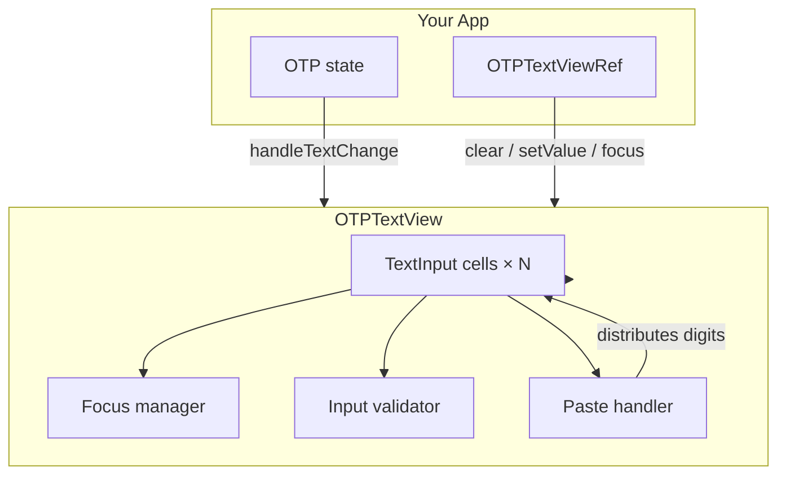
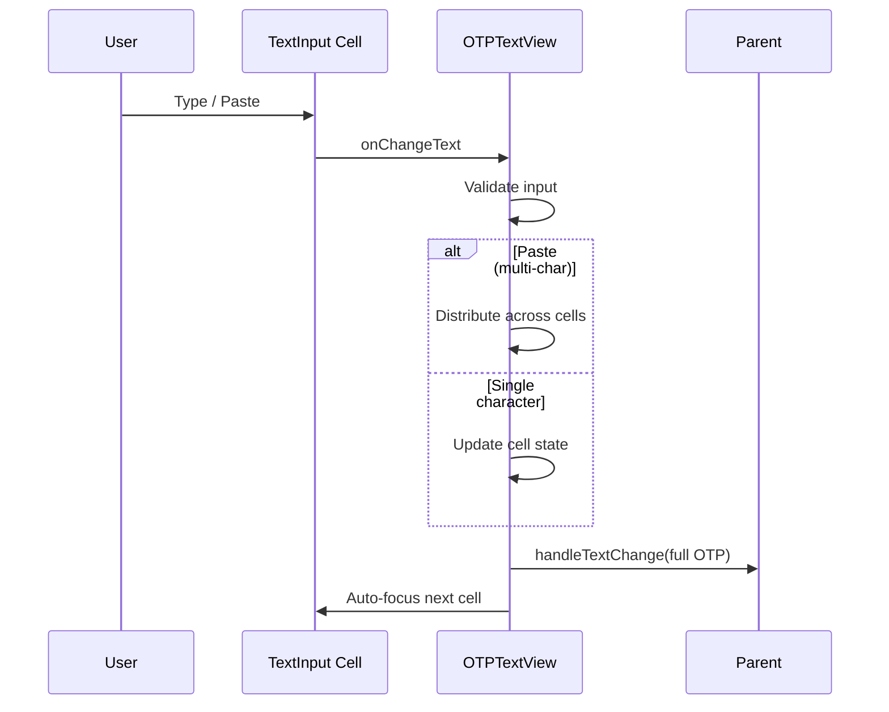

<div align="center">

# medhira-rn-otp-textinput

**A polished, customizable OTP / PIN input for React Native**

[](https://www.npmjs.com/package/medhira-rn-otp-textinput)
[](https://www.npmjs.com/package/medhira-rn-otp-textinput)
[](./LICENSE)
[](https://reactnative.dev)
[](https://medhira-rn-otp-textinput.readthedocs.io)


*Engineering Intelligence Across Everything*

</div>

---

Collect one-time passwords and PIN codes with a lightweight, fully typed React Native component. Built for authentication flows, phone verification, and secure code entry — with focus management, paste support, and ref-based control out of the box.

## Features

- **Flexible cell count** — configure 4, 6, or any number of OTP digits
- **Smart focus navigation** — auto-advance, backspace handling, paste distribution
- **Ref API** — `clear()`, `setValue()`, and `focus()` via imperative handle
- **Custom styling** — per-cell or global tint / off-tint colors
- **Keyboard-aware validation** — numeric-only or alphanumeric modes
- **TypeScript first** — exported props and ref types
- **Test-friendly** — configurable `testIDPrefix` on every cell
- **Zero native code** — pure JS, works with Expo and bare React Native

## Installation

```sh
# Expo
npx expo install medhira-rn-otp-textinput

# React Native
npm install medhira-rn-otp-textinput
```

## Quick Start

```tsx
import React, { useState } from 'react';
import { View, Text, StyleSheet } from 'react-native';
import { OTPTextView } from 'medhira-rn-otp-textinput';

export default function App() {
  const [otp, setOtp] = useState('');

  return (
    <View style={styles.container}>
      <Text style={styles.label}>Enter verification code</Text>
      <OTPTextView inputCount={6} handleTextChange={setOtp} />
      <Text style={styles.hint}>Entered: {otp || '—'}</Text>
    </View>
  );
}

const styles = StyleSheet.create({
  container: { padding: 24 },
  label: { fontSize: 16, marginBottom: 12 },
  hint: { marginTop: 16, color: '#666' },
});
```

## Architecture



## Props

| Prop | Type | Default | Description |
|------|------|---------|-------------|
| `defaultValue` | `string` | `''` | Initial OTP value |
| `inputCount` | `number` | `4` | Number of input cells |
| `inputCellLength` | `number` | `1` | Characters allowed per cell |
| `tintColor` | `string \| string[]` | `#3CB371` | Border color when focused |
| `offTintColor` | `string \| string[]` | `#DCDCDC` | Border color when unfocused |
| `handleTextChange` | `(text: string) => void` | — | Called with the full OTP string |
| `handleCellTextChange` | `(text: string, index: number) => void` | — | Called per cell change |
| `keyboardType` | `KeyboardType` | `numeric` | React Native keyboard type |
| `containerStyle` | `ViewStyle` | `{}` | Container style |
| `textInputStyle` | `ViewStyle` | `{}` | Per-cell input style |
| `testIDPrefix` | `string` | `otp_input_` | Prefix for cell test IDs |
| `autoFocus` | `boolean` | `false` | Focus first cell on mount |
| `editable` | `boolean` | — | Forwarded to each `TextInput` |
| `secureTextEntry` | `boolean` | — | Mask cell values |
| `accessibilityLabel` | `string` | — | Base label (appended with cell index) |

See the [full API reference](https://medhira-rn-otp-textinput.readthedocs.io/en/latest/api/) for all supported props.

## Ref Methods

```tsx
import React, { useRef } from 'react';
import { Button, View } from 'react-native';
import {
  OTPTextView,
  type OTPTextViewRef,
} from 'medhira-rn-otp-textinput';

export default function OtpWithRef() {
  const otpRef = useRef<OTPTextViewRef>(null);

  return (
    <View>
      <OTPTextView ref={otpRef} inputCount={6} />
      <Button title="Clear" onPress={() => otpRef.current?.clear()} />
      <Button
        title="Fill demo code"
        onPress={() => otpRef.current?.setValue('123456')}
      />
    </View>
  );
}
```

| Method | Signature | Description |
|--------|-----------|-------------|
| `clear` | `() => void` | Clears all cells and focuses the first |
| `setValue` | `(value: string, isPaste?: boolean) => void` | Sets OTP from a string |
| `focus` | `() => void` | Focuses the first cell |

## Styled Example

```tsx
import React, { useState } from 'react';
import { StyleSheet } from 'react-native';
import { OTPTextView } from 'medhira-rn-otp-textinput';

export default function StyledOtp() {
  const [otp, setOtp] = useState('');

  return (
    <OTPTextView
      inputCount={6}
      handleTextChange={setOtp}
      tintColor="#2563EB"
      offTintColor="#E5E7EB"
      containerStyle={styles.container}
      textInputStyle={styles.cell}
      autoFocus
    />
  );
}

const styles = StyleSheet.create({
  container: {
    justifyContent: 'center',
    gap: 8,
  },
  cell: {
    borderRadius: 12,
    borderWidth: 2,
    width: 48,
    height: 56,
    fontSize: 24,
  },
});
```

## Input Flow



## Requirements

- React 18+
- React Native 0.73+
- Works with Expo and bare React Native

## Documentation

Full docs are available on [ReadTheDocs](https://medhira-rn-otp-textinput.readthedocs.io):

- [Getting Started](https://medhira-rn-otp-textinput.readthedocs.io/en/latest/)
- [API Reference](https://medhira-rn-otp-textinput.readthedocs.io/en/latest/api/)
- [Examples](https://medhira-rn-otp-textinput.readthedocs.io/en/latest/examples/)
- [Architecture](https://medhira-rn-otp-textinput.readthedocs.io/en/latest/architecture/)

## Contributing

Contributions are welcome! Please open an issue or pull request on [GitHub](https://github.com/HELLOMEDHIRA/medhira-rn-otp-textInput).

```sh
git clone https://github.com/HELLOMEDHIRA/medhira-rn-otp-textInput.git
cd medhira-rn-otp-textInput
npm install
npm test
npm run prepare
```

Questions? Email [hello.medhira@gmail.com](mailto:hello.medhira@gmail.com?subject=medhira-rn-otp-textinput).

## Acknowledgements

Inspired by [react-native-otp-textinput](https://github.com/naveenvignesh5/react-native-otp-textinput) by naveenvignesh5.

## Sponsor & Support

To keep this library maintained, consider [sponsoring on GitHub](https://github.com/sponsors/smuniharish). For private support or customization, reach out on [LinkedIn](https://www.linkedin.com/in/smuniharish).

## License

[MIT](./LICENSE) — Made with love by [MEDHIRA](https://medhira.readthedocs.io/en/latest/)
