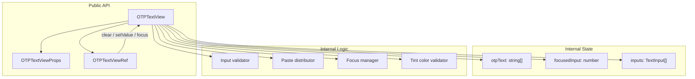
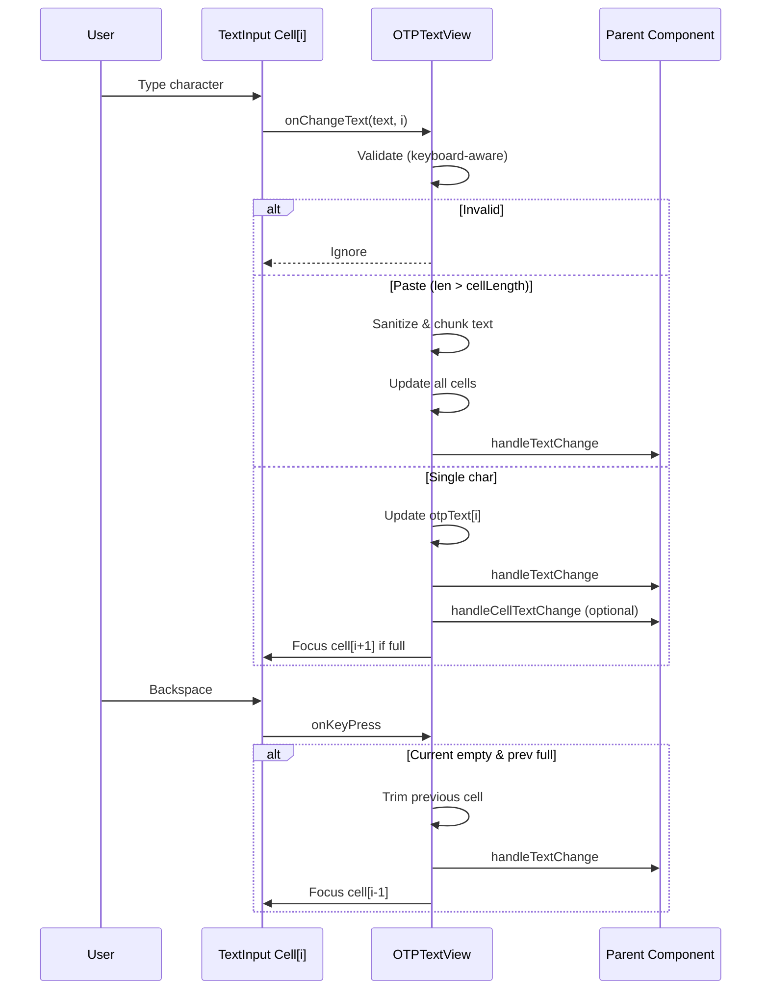
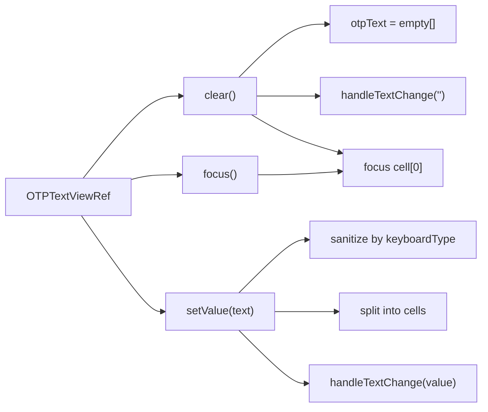

# Architecture

This page describes the internal design of `OTPTextView` at a high level. Only the public API (`OTPTextView`, `OTPTextViewProps`, `OTPTextViewRef`) is exported from the package.

## Component Structure

## Data Flow

## Ref Handle Flow

## Validation Rules

| `keyboardType` | Accepted characters |
|----------------|---------------------|
| `numeric`, `number-pad`, `phone-pad`, `decimal-pad` | Digits `0-9` |
| All other types | Alphanumeric `0-9`, `a-z`, `A-Z` |

Pasted text is sanitized before distribution across cells.

## Build Output

The published npm package contains:

- `lib/commonjs/` — CommonJS bundle
- `lib/module/` — ESM bundle
- `lib/typescript/` — Type declarations

Source maps are **not** published. The `src/` directory is included for transparency but is not part of the runtime import path.

## Design Decisions

1. **Pure JS component** — no native modules, ensuring Expo compatibility.
2. **Imperative ref API** — enables programmatic clear/set for verification retry flows.
3. **Cell-based state** — each digit is a separate `TextInput` for native keyboard and accessibility behavior.
4. **Paste as first-class** — multi-character input is detected and distributed automatically.
