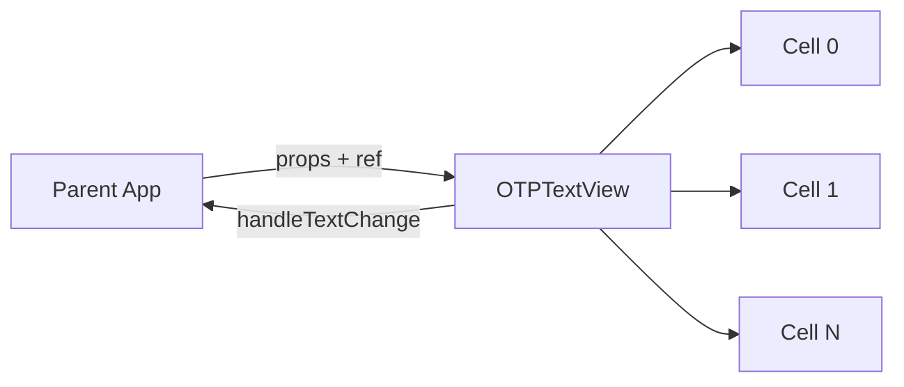

# Getting Started

Welcome to **medhira-rn-otp-textinput** — a customizable OTP/PIN text input component for React Native.

## Installation

### Expo

```sh
npx expo install medhira-rn-otp-textinput
```

### React Native

```sh
npm install medhira-rn-otp-textinput
```

## Quick Start

```tsx
import React, { useState } from 'react';
import { View, Text } from 'react-native';
import { OTPTextView } from 'medhira-rn-otp-textinput';

const App = () => {
  const [otp, setOtp] = useState('');

  return (
    <View>
      <OTPTextView inputCount={6} handleTextChange={setOtp} autoFocus />
      <Text>Entered OTP: {otp}</Text>
    </View>
  );
};

export default App;
```

## Features

- Customizable OTP input count and cell length
- Individual cell focus handling with auto-advance
- Paste support — distributes a full code across cells
- Ref API — `clear()`, `setValue()`, and `focus()`
- Custom tint colors for focused and unfocused states
- Keyboard-type-aware validation (numeric or alphanumeric)
- Common `TextInput` props forwarded (`editable`, `secureTextEntry`, accessibility)
- Test ID prefix support for every cell
- Auto-focus option
- Full TypeScript support

## Architecture Overview



See the [Architecture](./architecture.md) page for detailed flow diagrams.

## Requirements

- React 18+
- React Native 0.73+
- TypeScript optional but recommended

## Next Steps

- [API Reference](./api.md) — full props and ref methods
- [Examples](./examples.md) — styled, ref, and multi-color usage
- [Architecture](./architecture.md) — component design and input flow

## License

[MIT](./LICENSE)
